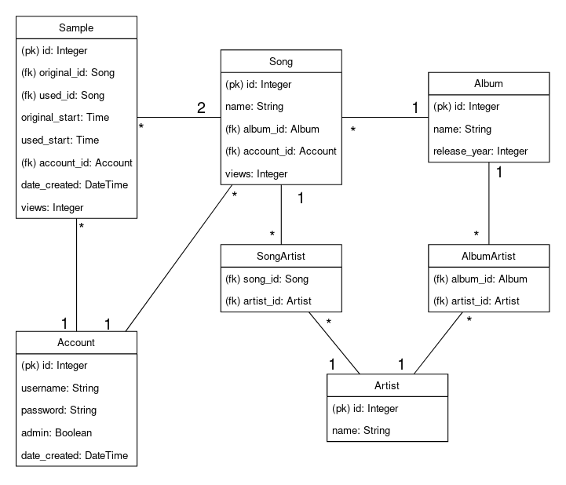

# Database structure

There are seven tables with two junction tables in the database.

Current database matches the programs needs, but there is room for improvements. For example I am not sure if it would be better to remove Song-Artist connection, and instead have Song-Featuring_Artist connection, because we can always get the main artist with connection Song-Album-Artist. But this could add more queries if we only want to search for Song and Artists.

## Database diagram

## SQL for creating the tables
### 1. Account
<pre><code>
CREATE TABLE account (
	id INTEGER NOT NULL,
	username VARCHAR(120) NOT NULL,
	password VARCHAR(200) NOT NULL,
	admin BOOLEAN NOT NULL,
	date_created DATETIME NOT NULL,
	PRIMARY KEY (id),
	CHECK (admin IN (0, 1))
);
</code></pre>
### 2. Album
<pre><code>
CREATE TABLE album (
	id INTEGER NOT NULL,
	name VARCHAR(120) NOT NULL,
	release_year INTEGER,
	PRIMARY KEY (id)
);
</code></pre>
### 3. Artist
<pre><code>
CREATE TABLE artist (
	id INTEGER NOT NULL,
	name VARCHAR(120) NOT NULL,
	PRIMARY KEY (id)
);</code></pre>
### 4. Song
<pre><code>
CREATE TABLE song (
	id INTEGER NOT NULL,
	name VARCHAR(120) NOT NULL,
	views INTEGER NOT NULL,
	account_id INTEGER NOT NULL,
	album_id INTEGER,
	PRIMARY KEY (id),
	FOREIGN KEY(account_id) REFERENCES account (id),
	FOREIGN KEY(album_id) REFERENCES album (id)
);
</code></pre>
### 5. Sample
<pre><code>
CREATE TABLE sample (
	id INTEGER NOT NULL,
	original_id INTEGER NOT NULL,
	used_id INTEGER NOT NULL,
	original_start TIME NOT NULL,
	used_start TIME NOT NULL,
	views INTEGER NOT NULL,
	account_id INTEGER NOT NULL,
	date_created DATETIME NOT NULL,
	PRIMARY KEY (id),
	FOREIGN KEY(original_id) REFERENCES song (id),
	FOREIGN KEY(used_id) REFERENCES song (id),
	FOREIGN KEY(account_id) REFERENCES account (id)
);
</code></pre>
### 6. Album_artist
<pre><code>
CREATE TABLE album_artist (
	artist_id INTEGER NOT NULL,
	album_id INTEGER NOT NULL,
	PRIMARY KEY (artist_id, album_id),
	FOREIGN KEY(artist_id) REFERENCES artist (id),
	FOREIGN KEY(album_id) REFERENCES album (id)
);
</code></pre>
### 7. Song_artist
<pre><code>
CREATE TABLE song_artist (
	artist_id INTEGER NOT NULL,
	song_id INTEGER NOT NULL,
	PRIMARY KEY (artist_id, song_id),
	FOREIGN KEY(artist_id) REFERENCES artist (id),
	FOREIGN KEY(song_id) REFERENCES song (id)
);
</code></pre>
